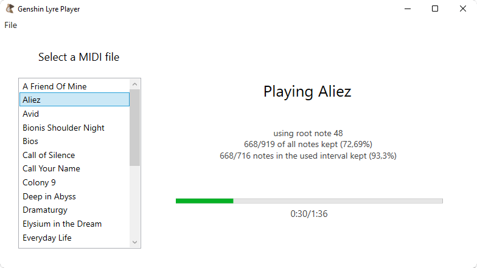

---

# GenshinLyrePlayer
## Presentation

**GenshinLyrePlayer** is a free, open source and easy to use application that allows you to play automatically any real world song you like in Genshin Impact with the musical instruments gadgets (i.e. the [Windsong Lyre](https://genshin-impact.fandom.com/wiki/Windsong_Lyre) and the [Floral Zither](https://genshin-impact.fandom.com/wiki/Floral_Zither)).

## Disclaimer

There is a disclaimer in-game regarding the use of the lyre:

> When using the Performance function, please make sure that you use an original composition or have the relevant rights to use the melody you are playing in order to avoid harming the rights of any third parties and to avoid any actions in breach of or incompatible with our Terms of Service. Otherwise, we may have to restrict your use of this function.
> Additionally, the content you perform can be heard and used by other players using this in-game function. Please read and confirm that you acknowledge the aforementioned stipulations.

Please be aware of this, keep it in mind and use this program at your own risks.

## Usage

- [Download the latest release](https://github.com/CypElf/GenshinLyrePlayer/releases/latest) and put it in anywhere you want on your disk.
- Put the MIDI files (`.mid`) of the songs you want in a `songs` folder, in the same folder as the executable you just downloaded. You can find MIDI files online for almost any song or compose your own.
- Run the program and go to `File` → `Settings` to change the keyboard layout to your keyboard's one.
- Optionally, you can change the keys used to start and stop songs.
- Select the song you want and press `F6` or the start key you set to start playing it.

A video tutorial is also available on YouTube :

## Caveats

Because the musical instruments gadgets in Genshin Impact only have 3 [octaves](https://en.wikipedia.org/wiki/Octave), it's impossible to play all the notes of a MIDI file using notes on more than 3 octaves. This results in notes **not being played**. 
There's no perfect solution, because we just can't completely reproduce a song with less octaves.

To mitigate the issue, the program always chooses an interval of 3 octaves in which there are as many notes as possible, in order to drop the minimum amount of notes. 
The result depends heavily on the song : songs with almost all notes in the same octaves will work well, while songs with a lot of notes across all octaves will experience very bad reproduction.

When you start a song, you will see informations about what root note is used and how many notes have been kept from the original. 
You can try to change the root note manually in the settings for another note you want, but it will almost always be better to let the program figure out the best root note automatically.